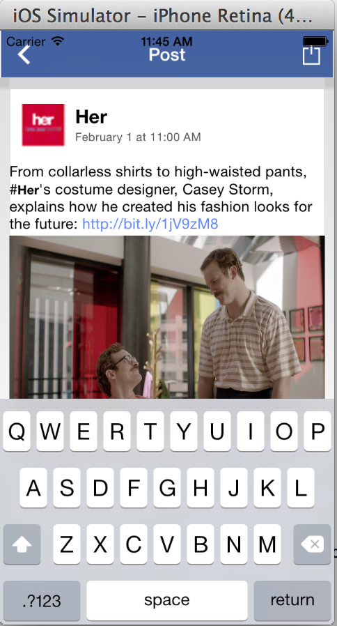

FacebookPost
============

# RottenTomatoes app Demo

 
This is an iOS application for an unscrollable detail view of Facebook post

Notes:

Spent some time trying to  move the textfield when the keyboard appears, need to look into it more.

Also, did not find the asset for Share.

Walkthrough of all user stories:

&nbsp;&nbsp;
